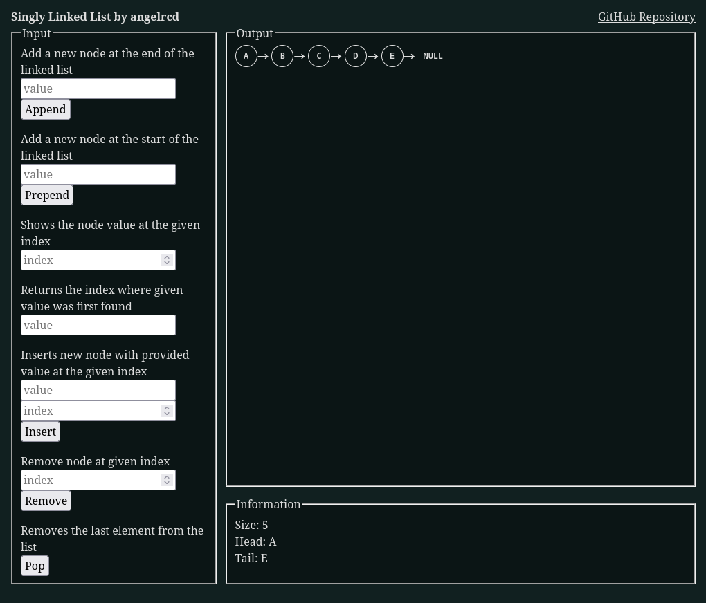

# Linked List
Singly Linked List implemented with JavaScript

## Links
- [Linked List Visualizer](https://angelrcd.github.io/odin-linkedlist/)
- [Link to assignment](https://www.theodinproject.com/lessons/javascript-linked-lists)

## Summary
All of the Linked list related logic can be found in my `linkedList.js` file. This project contains two classes: `Node` and `LinkedList`

### Features
- `size` returns the total number of nodes in the list
- `head` returns the first node in the list
- `tail` returns the last node in the list
- `append(value)` adds a new node containing value to the end of the list or to start if list is empty
- `prepend(value)` adds a new node containing value to the start of the list
- `at(index)` returns the node at the given index or error message if there is no node in the requested index
- `pop()` removes the last element from the list
- `contains(value)` returns true if the passed in value is in the list and otherwise returns false
- `find(value)` returns the index of the node containing value, or null if not found
- `insertAt(value, index)` inserts a new node with the provided value at the given index or at the end of the list if index is bigger than list size
- `removeAt(index)` removes the node at the given index or error message if the list is empty or if the request index is bigger than list size
- `toString()` returns your LinkedList objects as strings in the format: `( value ) -> ( value ) -> ( value ) -> null`
- `getHTMLNodesList()` used for the visualizer webpage